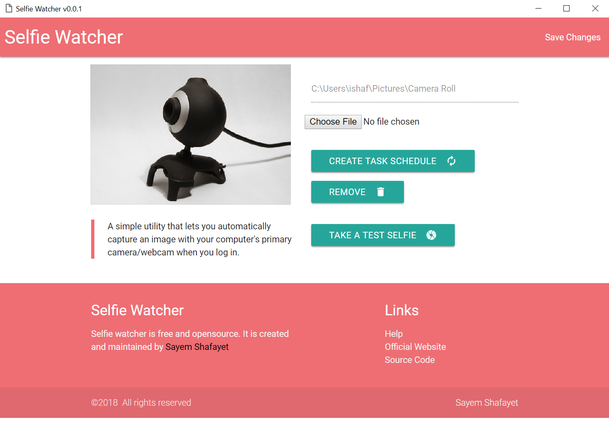

# selfie-watcher

[Downloads](https://github.com/iShafayet/selfie-watcher/releases)

A simple utility that lets you automatically capture an image with your computer's primary camera/webcam when you log in.

It supports automatically adding itself (in invisible mode) to the Windows Task Scheduler so that it can run when you (or someone) logs into windows.

Currently only tested on Windows10 64 bit but there is no reason why it won't support ubuntu/osx or other windows. Treat me to a pull request if you decide to create builds for any of those platforms.

# license

[MIT LICENSE](LICENSE)
